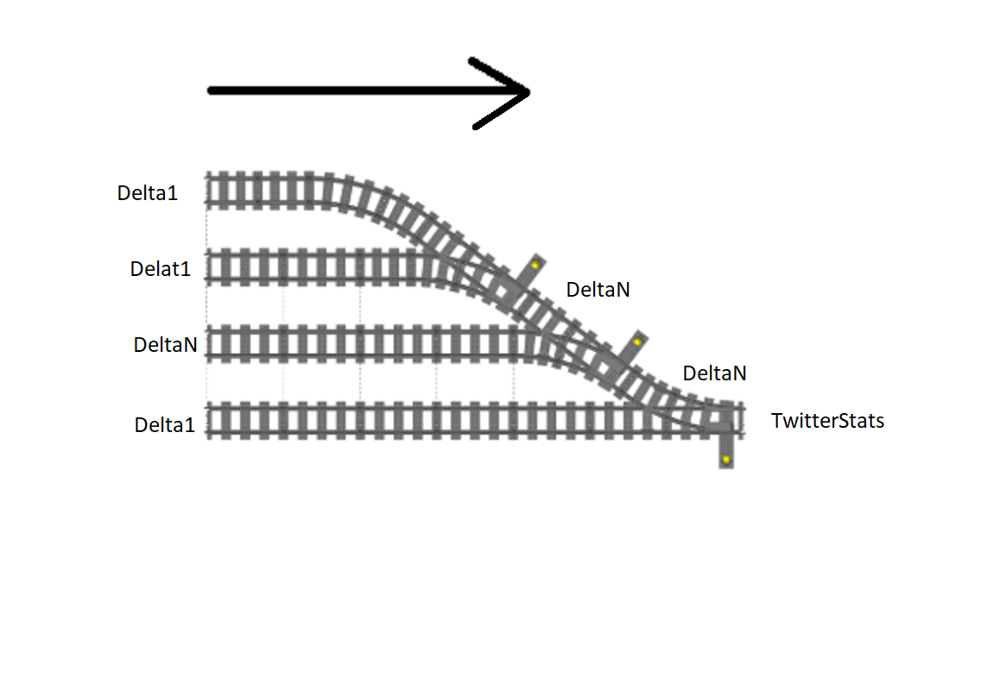

# Twitter Statistics

## Design Trade offs

* Functional streams and effects
* Actors (akka) and futures
* kafka distrbuted messaging & spark streams

Storage choices
* persistent streams -> event sourcing
* relational / NSQL database

## Design
### Chosen
* Asynchronous, no blocking. On one node, this scales up by simply upgrading hardware with more
  multi-cores (threads) and memory.
* Functional streams (fs2 / http4s): 
  - code that can be reasoned with, easy to split and combine as needed, can be extended to scale up
  - in conformance with Banno's tech-stack (and typelevel)
  - learning curve of http4s / fs2 concepts
 
 ### Summing up streams of deltas
 Follows a natual map reduce tree of streams \
 Tweet -> Delta \
 Delta Stream -> Stream of (sum of deltas) -> Tweet Statistics
 
 Delta1 is the statistics delta from 1 tweet\
 DeltaN is the sum of N. (Delta1 can be considered as a degenerate case of N = 1)
 
 

The deltas are merged into Twitter Statistics. This is the only mutable variable in the program: \
`currentStats: AtomicReference[TwitterStats]`  
This one and only mutable variable is modified in a thread-safe way by tasks in a separate executor
dedicated (fixed thread pool) for this purpose. All other code is made of functions on immutable data. 

### Scope
  
In the current implementation, subscribed to one  sample endpoint and statistics are derived asynchronously 
from the tweet-stream on one node (virtual machine). This can be scaled up in the following ways

### Scaling up
- On one node, we can scale it up by increasing processors and memory. This non-blocking program
  scales up to take advantage of all threads / CPUs.
- N connections to twitter: multiple client nodes connect to twitter servers in parallel and process
  concurrent streams. This needs deduplication of tweets in case same tweet comes in again.
- connection retries: reconnect again if a connection is lost.With the redundancy of multiple connections,
  tweets are not lost during the connection outage.
- Multiple Nodes: Distribute the streams across nodes. The algebra of summing deltas is a semigroup.
  Because of this delta streams can be split, processed concurrently and combined as per load.
  To process streams across multiple nodes needs a distributed messaging system (kafka cluster)

## Tweet Storage
- persistent streams, e.g. distributed transaction log of kafka messages. Then, any state of the past
  twitter statistics can be reconstructed by replaying the log (cf. "event sourcing"). This is useful
  for keeping a record of tweets, going back in history, testing, validations etc.
- Or use a database for storage (SQL or NSQL depending on queries needed)

## Statistics calculation

### Average Tweet Rate
Average tweet rate at current instant is calculated by dividing the total tweet with how much time elapsed from the beginning.

### Emoji Parsing
- Each emoji is designated by a sequence of unicode code points in the json-field "unified" of emoji_data.json
  * Emoji modifiers such as skin tone variations are considered to be the same emoji
  * Emoji ZWJ sequences are considered as separate emojis
  
# Performance measurement

# Further Work
- Nicer UI pages
- Dash board of tweet statistics graphs over a period of:
  - last sec, min, hour
  - last day and week
  - last month and year
